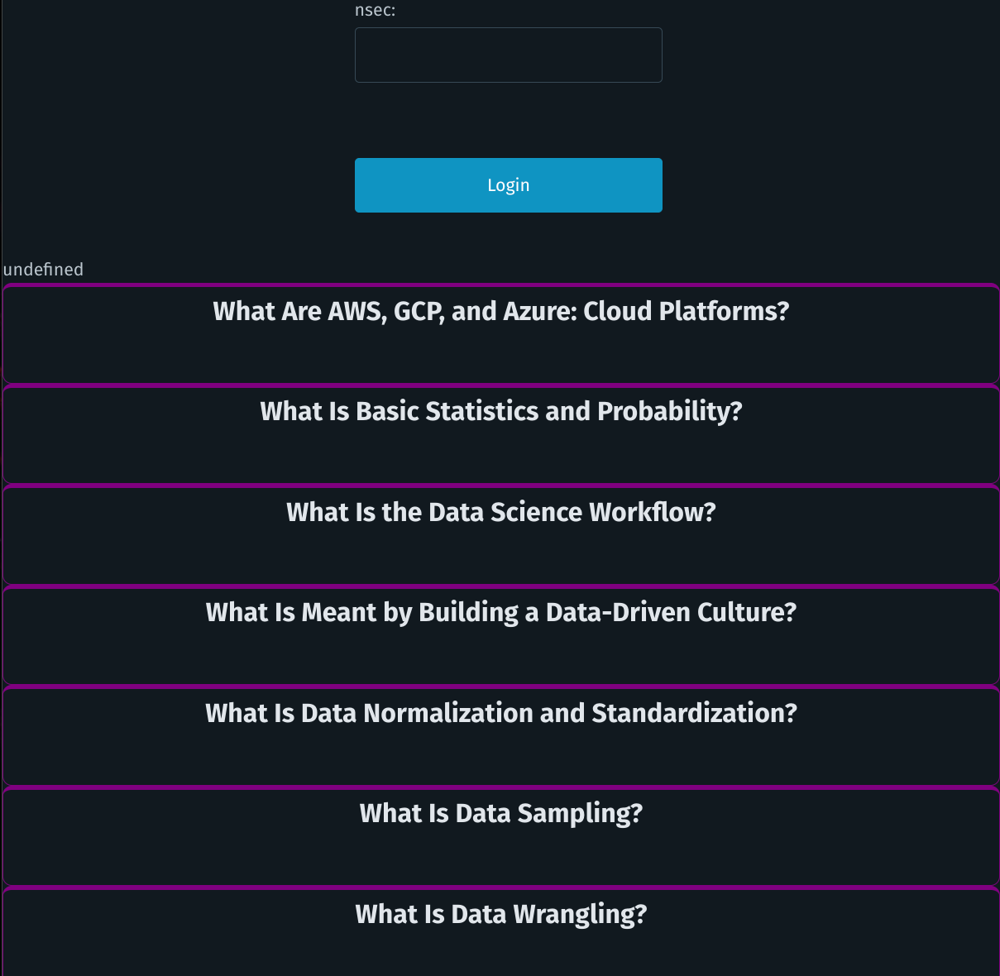
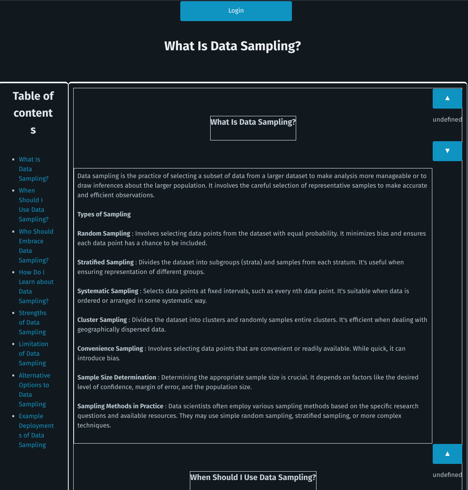

# indextr

indextr is a nostr knowledge base (NKB).

## Requests for help and feedback
- Rendering other note types. Heterogeneous articles can potentially include any other kind - 0, 1, 1808, 30023, sandboxed executable code, images with captions External API calls to other interactive services (e.g. music notes that play audio when clicking)
- Article creation and uploading within the browser. Currently, articles are created and uploaded through NodeJS, would be nice for user entry fields.
- Design requests
# Screenshot
- Home Page, Displays Kind 30040 and article metadata

- Article Page. Composes article from notes (kind 30041, but potentially any other renderable kind) listed from the 30040 event



Still under development. Read more [here](https://github.com/limina1/indextr-principles/tree/main/details.md).
## Developing

Once you've created a project and installed dependencies with `npm install` (or `pnpm install` or `yarn`), start a development server:

```bash
npm run dev

# or start the server and open the app in a new browser tab
npm run dev -- --open
```

## Building

To create a production version of your app:

```bash
npm run build
```

You can preview the production build with `npm run preview`.

> To deploy your app, you may need to install an [adapter](https://kit.svelte.dev/docs/adapters) for your target environment.
